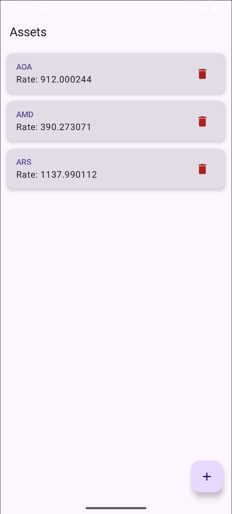
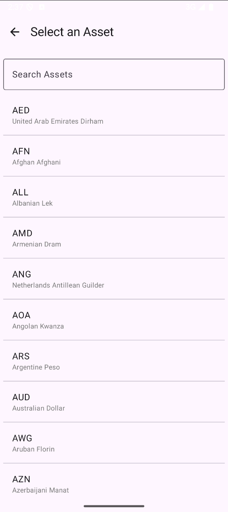
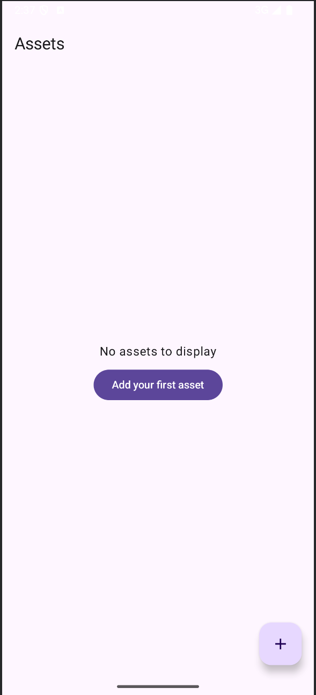

# 📊 AssetRatesApp

**AssetRatesApp** is a simple yet powerful Android app built with **Jetpack Compose**, **Coroutines**, **Room**, **Retrofit**, and **Hilt**.  
It displays **live exchange rates** for a list of user-selected fiat or crypto currencies using the [ExchangeRate.host API](https://exchangerate.host/).

---

## 🚀 Features

- View live FX/crypto rates
- Add or remove assets (e.g., USD, EUR, BTC, etc.)
- Auto-refresh rates every 3 seconds (non-blocking)
- Persist assets using Room
- Searchable add screen
- Smooth animations on rate update
- Basic error handling (API key issues, no connection)
- MVVM + MVI architecture with clean code structure

---

## 🛠 Tech Stack

- 🖌 **Jetpack Compose** — UI
- 🧠 **ViewModel + MVI** — State management
- 🌐 **Retrofit + OkHttp** — Network
- 💾 **Room** — Local database
- 🔪 **Dagger Hilt** — Dependency injection
- ⏱ **Coroutines + Flow** — Async & reactivity

---

## 📸 Screenshots

### Home Screen


### Add Asset Screen


### API Key Error



## 🧪 Coming Soon / Future Work

- UI tests with `androidx.compose.ui.test`
- Unit tests for ViewModels and UseCases
- Support for dark mode
- Multi-currency conversions

---

## 🔐 API Key Setup

To use the ExchangeRate.host API, you need an access key.

### 1. Sign Up

Go to [https://exchangerate.host](https://exchangerate.host) and sign up for a free account to get your `access_key`.

---

### 2. Add to `local.properties`

In the root of your project (next to `build.gradle.kts`):

```properties
EXCHANGE_RATE_API_KEY=your_api_key_here

